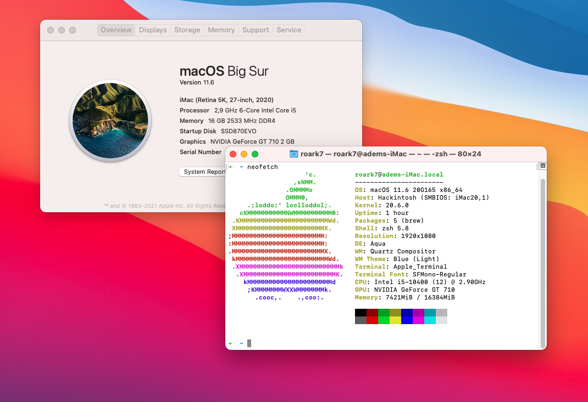
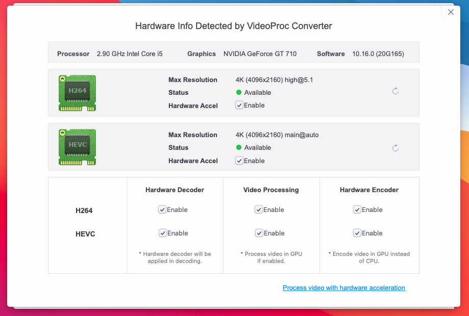

# Custom iMac20,1 - OpenCore 0.7.4

I will put more detail later

| Specifications  |  Detail |
|---|---|
| Processor |Intel Core i5-10400 2.80 GHz|
| Memory | Patriot Viper Steel 8x2 GB 3200 MHz DDR4|
| iGPU | Intel UHD Graphics 630|  
| dGPU | Asus GT710-SL-2GD5-BRK|  
| Storage |500GB SSD + 1TB HDD|
| Sound Card | ALC 887 |
| Wireless Card |Intel AX200|

## Screenshots

