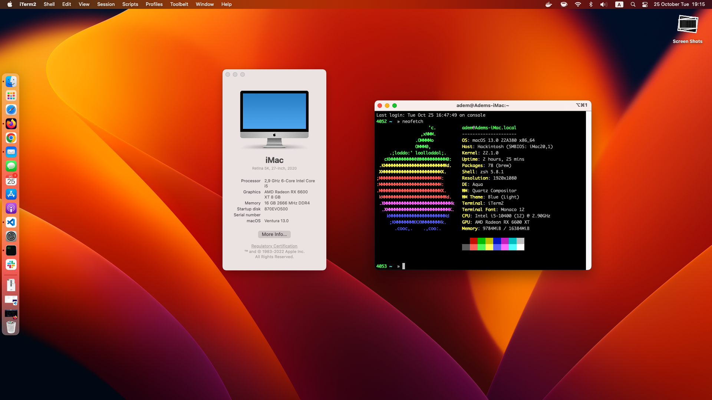

# OpenCore 0.9.1 | macOS Ventura 13.3.1 (22E261)

I followed [Dortania's OpenCore Install Guide](https://dortania.github.io/OpenCore-Install-Guide/prerequisites.html) during the installation.

What's not working?

- DRM is broken on Safari

What' working?

- Bluetooth
- AirDrop
- FaceTime
- Metal support
- Sleep
- HDMI audio

| Specifications | Detail                                   |
| -------------- | ---------------------------------------- |
| Motherboard    | ASUS PRIME H470-PLUS                     |
| Processor      | Intel Core i5-10400 2.90 GHz             |
| Memory         | Patriot Viper Steel 8x2 GB 3200 MHz DDR4 |
| iGPU           | Intel UHD Graphics 630                   |
| dGPU           | Sapphire Pulse Radeon RX 6600 XT         |
| Storage        | 500GB SSD + 1TB HDD                      |
| Sound Card     | ALC 887                                  |
| Network Card   | BCM94360NG                               |

PS. If you are planning to upgrade GPU, don't forget to reset the bios.

## Screenshots

